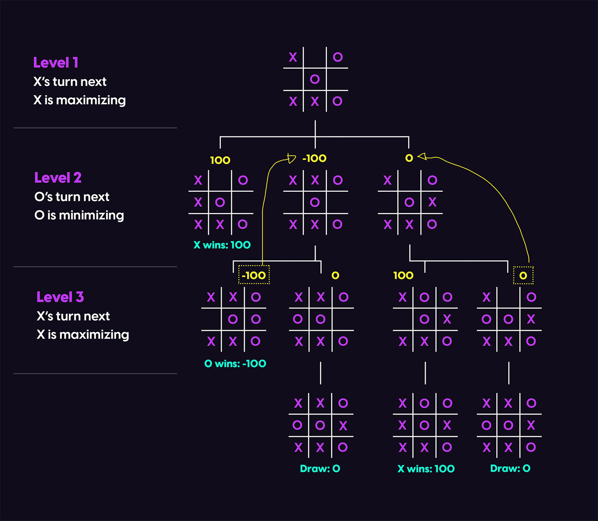
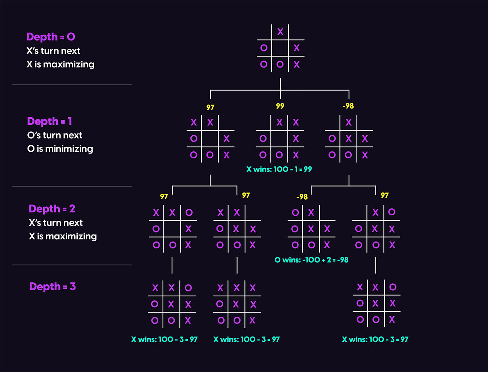
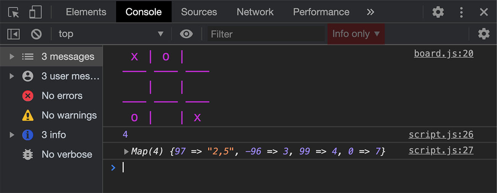
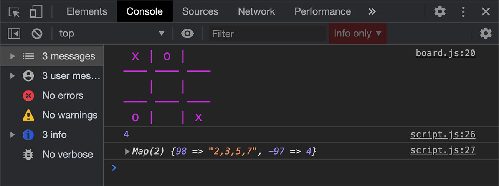

[[lead]]
| In the <Link to="/blog/tic-tac-toe-js">previous part</Link> we created a JavaScript class for our tic-tac-toe board. Let's in this part learn how to implement the [minimax algorithm](https://en.wikipedia.org/wiki/Minimax) in JavaScript to get the best move for the computer player. We will calculate each possible move’s heuristic value given some assumptions and a depth (the the number of turns to calculate).

<Box>
    <strong>
        View a <a href="https://codesandbox.io/s/elegant-merkle-dy0z6">demo</a> or visit{" "}
        <a href="https://github.com/alialaa/tic-tac-toe-js-2020">the project’s github page</a>.
    </strong>
</Box>

_This is the second part of a 3 parts series. Below you can find the list of other parts:_

-   <Link to="/blog/tic-tac-toe-js">Part 1: Building the Tic-Tac-Toe Board</Link>
-   Part 2: AI Player with Minimax Algorithm
-   <Link to="/blog/tic-tac-toe-js-ui">Part 3: Building the User Interface</Link>

<br />

To create an AI player, we need to mimic how a human would think when playing a tic-tac-toe game. In real life, a human would think of all the possible consequences for each move. This is where the minimax algorithm comes handy. The minimax algorithm is a decision rule used to determine the best possible move in games where all possible moves can be foreseen like tic-tac-toe or chess.

## Minimax Algorithm in Tic-Tac-Toe

To apply the minimax algorithm in two-player games, we are going to assume that X is a **maximizing** player and O is a **minimizing** player. The maximizing player will try to maximize his score or in other words choose the move with the highest value. The minimizing player will try to minimize the value for the maximizing player, thus choosing the move with the minimum value.

In order to calculate the values mentioned above, we need to decide on some assumptions. We call these values heuristic values. In tic-tac-toe we have 3 possibilities:

-   **The state of the board is a draw:** We will give this board a value of 0;
-   **X wins in a board state:** We will give this board a value of 100;
-   **O wins in a board state:** We will give this board a value of -100;

## Minimax Example with Game Tree

To illustrate the minimax algorithm more, let’s take a look at a visual example. In the diagram below, consider a situation where it’s X’s turn given the current state. X has three possible moves:



-   **Level 1:** X has three possible moves and tries to find the maximum node.
-   **Level 2:** The first move leads to direct win for X thus 100 points are given.
-   **Level 2:** The second and third moves will lead to two more possible moves where it’s O’s turn.
-   **Level 3:** O is trying to minimize the score so it chooses the nodes with the minimum value.
-   **Level 3:** The first move for O will lead to a win and the second to a draw, thus we assume that O is going to choose the first move and the parent node will have a value of -100. Same for the third and fourth moves.
-   **Back to Level 1**, X now has to choose between 100, -100 and 0. Since X is the maximizer, it will definitely choose 100 which will lead to a win.

As you can notice, we recursively propagate the possibilities tree calculating the score for each terminal state and then going back to decide which move we will take.

## Adding Depth to the Calculations

Now imagine a situation where X can win in two possible ways but one way takes more moves than the other. If we follow our current implementation, both moves will return a score of 100. We will then randomly choose the move; however, it would be better if we directly choose the shortest way to win.

To tackle that, we will subtract the depth or the current level from the score of the board in case the player is a maximizing one or add the depth to the score in case it is a minimizing player. That way for a maximizing player the shorter path will have a higher score since a lower depth is subtracted from it and vice versa for a minimizing player.

This way will also help lose in a longer way if there is a shorter way to loose. Here is a visual example after adding depth:



In the case above, X will obviously choose 99 over 97 since it’s an easier way to win.

## JavaScript Implementation

It’s time now to translate this theory into code. In our **classes** folder, let's create a new file called **player.js**. The Player class will be constructed with a maximum depth argument. This argument will be used to limit how deep the computer will propagate through the tree. That way the lower depth we choose, the easier the game will be.
In addition to that, we will define a new map. The keys for this map will hold a certain heuristic value, and the value will hold a comma separated string for all the moves that resulted in that value. That way for a maximizing player we can choose the highest key and the move will be either the value or a random value if there are multiple values.

```js:title=player.js
import Board from "./board.js";

export default class Player {
    constructor(maxDepth = -1) {
        this.maxDepth = maxDepth;
        this.nodesMap = new Map();
    }
}
```

Now let’s add a method to this class called **getBestMove()**. As mentioned, this is going to be a recursive function. This function will receive a board instance, a boolean to decide if the player is maximizing or minimizing, a callback function to run after calculation (this will be used when we build our UI) and the depth of the current node.

Inside our function, each call will have a different depth depending on the level we are currently at. In order to do some operation at the main function call i.e. at the very top level not a recursive call, we will check if the depth is equals to zero.

The first thing that we will do inside the function is clearing the **nodesMap** map from previous calculations if we are calculating the value of the very top node.

Then we will add the base of our recursive function. Every recursive function must have a base or a point where the recursion will stop otherwise we might end up with an infinite recursion. In our case, the recursion will stop when a terminal state is reached or the depth reached the maximum depth. In that case we will return the heuristic value of the state:

```js:title=player.js
getBestMove(board, maximizing = true, callback = () => {}, depth = 0) {
    //clear nodesMap if the function is called for a new move
    if(depth == 0) this.nodesMap.clear();

    //If the board state is a terminal one, return the heuristic value
    if(board.isTerminal() || depth === this.maxDepth ) {
        if(board.isTerminal().winner === 'x') {
            return 100 - depth;
        } else if (board.isTerminal().winner === 'o') {
            return -100 + depth;
        }
        return 0;
    }
}
```

Now we will check if it's the maximizing player's turn and then loop through all the empty cells using **getAvailableMoves()** method that we created in the previous part. Inside the loop, we will create a new board and insert the symbol in the current empty cell in the loop and then call **getBestMove()** recursively but this time with the new board, the minimizing player turn and an incremented by one depth. Afterwards, we compare the output of the function with the current best value and update it if needed. Still inside the loop, we check if we are at the top level and if so we store our values in **nodesMap**.

Outside the loop, we check if we are at the top level and return the index of the cell that corresponds to the best value or a random index if multiple indices have the best value.

```js:title=player.js
if (maximizing) {
    //Initialize best to the lowest possible value
    let best = -100;
    //Loop through all empty cells
    board.getAvailableMoves().forEach(index => {
        //Initialize a new board with a copy of our current state
        const child = new Board([...board.state]);
        //Create a child node by inserting the maximizing symbol x into the current empty cell
        child.insert("x", index);
        //Recursively calling getBestMove this time with the new board and minimizing turn and incrementing the depth
        const nodeValue = this.getBestMove(child, false, callback, depth + 1);
        //Updating best value
        best = Math.max(best, nodeValue);

        //If it's the main function call, not a recursive one, map each heuristic value with it's moves indices
        if (depth == 0) {
            //Comma separated indices if multiple moves have the same heuristic value
            const moves = this.nodesMap.has(nodeValue)
                ? `${this.nodesMap.get(nodeValue)},${index}`
                : index;
            this.nodesMap.set(nodeValue, moves);
        }
    });
    //If it's the main call, return the index of the best move or a random index if multiple indices have the same value
    if (depth == 0) {
        if (typeof this.nodesMap.get(best) == "string") {
            const arr = this.nodesMap.get(best).split(",");
            const rand = Math.floor(Math.random() * arr.length);
            const ret = arr[rand];
        } else {
            ret = this.nodesMap.get(best);
        }
        //run a callback after calculation and return the index
        callback(ret);
        return ret;
    }
    //If not main call (recursive) return the heuristic value for next calculation
    return best;
}
```

Similarly, we will check if the player is minimizing and our code will be very similar, except for minor changes like inserting o instead of x and using Math.min instead of Math.max. Here is our final class:

```js:title=player.js
import Board from "./board.js";

export default class Player {
    constructor(maxDepth = -1) {
        this.maxDepth = maxDepth;
        this.nodesMap = new Map();
    }
    getBestMove(board, maximizing = true, callback = () => {}, depth = 0) {
        //clear nodesMap if the function is called for a new move
        if (depth == 0) this.nodesMap.clear();

        //If the board state is a terminal one, return the heuristic value
        if (board.isTerminal() || depth === this.maxDepth) {
            if (board.isTerminal().winner === "x") {
                return 100 - depth;
            } else if (board.isTerminal().winner === "o") {
                return -100 + depth;
            }
            return 0;
        }
        if (maximizing) {
            //Initialize best to the lowest possible value
            let best = -100;
            //Loop through all empty cells
            board.getAvailableMoves().forEach(index => {
                //Initialize a new board with a copy of our current state
                const child = new Board([...board.state]);
                //Create a child node by inserting the maximizing symbol x into the current empty cell
                child.insert("x", index);
                //Recursively calling getBestMove this time with the new board and minimizing turn and incrementing the depth
                const nodeValue = this.getBestMove(child, false, callback, depth + 1);
                //Updating best value
                best = Math.max(best, nodeValue);

                //If it's the main function call, not a recursive one, map each heuristic value with it's moves indices
                if (depth == 0) {
                    //Comma separated indices if multiple moves have the same heuristic value
                    const moves = this.nodesMap.has(nodeValue)
                        ? `${this.nodesMap.get(nodeValue)},${index}`
                        : index;
                    this.nodesMap.set(nodeValue, moves);
                }
            });
            //If it's the main call, return the index of the best move or a random index if multiple indices have the same value
            if (depth == 0) {
                let returnValue;
                if (typeof this.nodesMap.get(best) == "string") {
                    const arr = this.nodesMap.get(best).split(",");
                    const rand = Math.floor(Math.random() * arr.length);
                    returnValue = arr[rand];
                } else {
                    returnValue = this.nodesMap.get(best);
                }
                //run a callback after calculation and return the index
                callback(returnValue);
                return returnValue;
            }
            //If not main call (recursive) return the heuristic value for next calculation
            return best;
        }

        if (!maximizing) {
            //Initialize best to the highest possible value
            let best = 100;
            //Loop through all empty cells
            board.getAvailableMoves().forEach(index => {
                //Initialize a new board with a copy of our current state
                const child = new Board([...board.state]);

                //Create a child node by inserting the minimizing symbol o into the current empty cell
                child.insert("o", index);

                //Recursively calling getBestMove this time with the new board and maximizing turn and incrementing the depth
                let nodeValue = this.getBestMove(child, true, callback, depth + 1);
                //Updating best value
                best = Math.min(best, nodeValue);

                //If it's the main function call, not a recursive one, map each heuristic value with it's moves indices
                if (depth == 0) {
                    //Comma separated indices if multiple moves have the same heuristic value
                    const moves = this.nodesMap.has(nodeValue)
                        ? this.nodesMap.get(nodeValue) + "," + index
                        : index;
                    this.nodesMap.set(nodeValue, moves);
                }
            });
            //If it's the main call, return the index of the best move or a random index if multiple indices have the same value
            if (depth == 0) {
                let returnValue;
                if (typeof this.nodesMap.get(best) == "string") {
                    const arr = this.nodesMap.get(best).split(",");
                    const rand = Math.floor(Math.random() * arr.length);
                    returnValue = arr[rand];
                } else {
                    returnValue = this.nodesMap.get(best);
                }
                //run a callback after calculation and return the index
                callback(returnValue);
                return returnValue;
            }
            //If not main call (recursive) return the heuristic value for next calculation
            return best;
        }
    }
}
```

Let’s test this function now and also take a look at how the **nodesMap** map looks like. In **script.js** let's type:

```js:title=script.js
import Board from "./classes/board.js";
import Player from "./classes/player.js";

const board = new Board(["x", "o", "", "", "", "", "o", "", "x"]);
board.printFormattedBoard();
const p = new Player();
console.log(p.getBestMove(board));
console.log(p.nodesMap);
```



As you can see, cell 4 is decided as the best move for X since it will lead to a direct win. Let’s take a look at the same board but this time if it was O’s turn:

```js:title=script.js
import Board from "./classes/board.js";
import Player from "./classes/player.js";

const board = new Board(["x", "o", "", "", "", "", "o", "", "x"]);
board.printFormattedBoard();
const p = new Player();
console.log(p.getBestMove(board, false)); //false for minimizing turn
console.log(p.nodesMap);
```



And obviously, 4 is also the best move for O since it will prevent a loss.

Finally, it’s worth mentioning that this algorithm’s performance can be improved using [alpha-beta pruning](https://en.wikipedia.org/wiki/Alpha%E2%80%93beta_pruning). You can take a look at that if you are interested.

<br />

In the next and final part, we will build the UI and interactions for our board.
